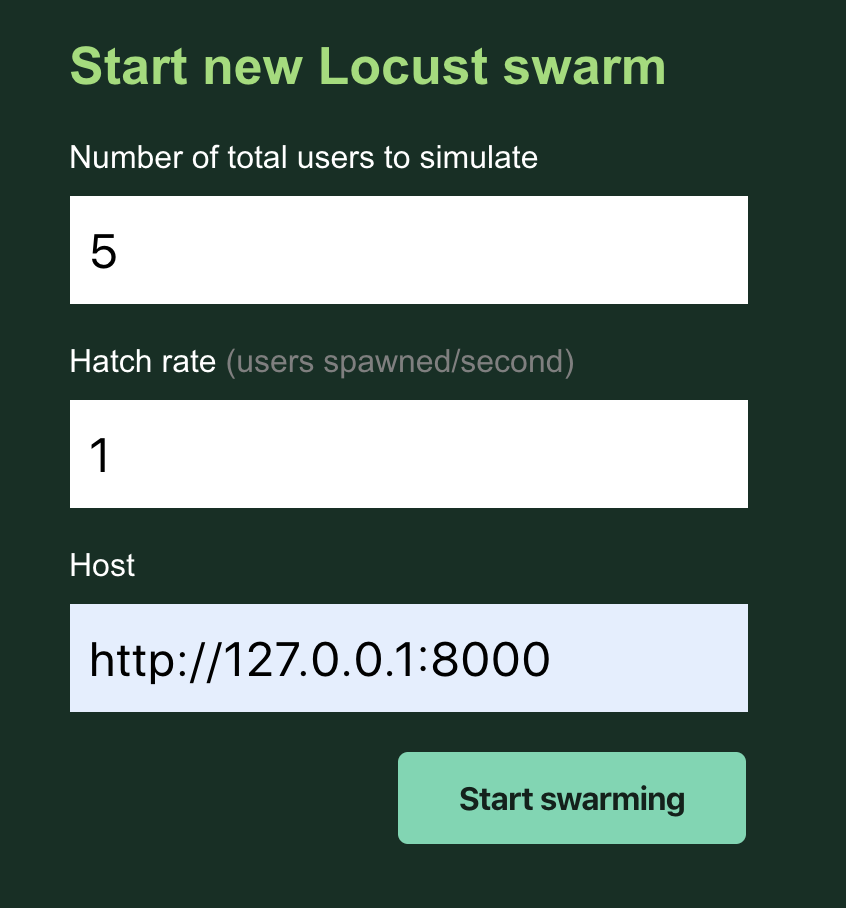
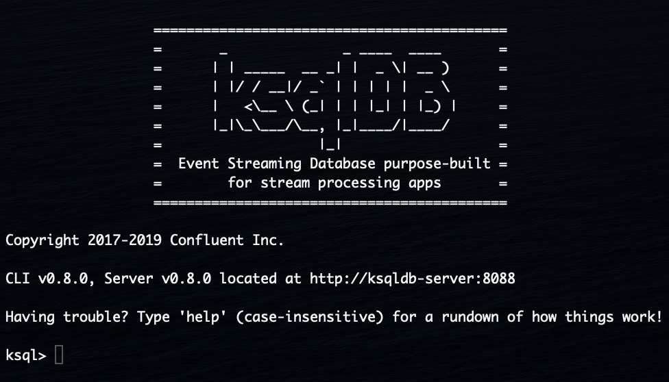

# protobuf-ksql
This demo extends Matt Howlett's blog post [**Integrating Apache Kafka With Python Asyncio Web Applications**](https://www.confluent.io/blog/kafka-python-asyncio-integration/) to demonstrate support for protocol buffers in ksqldb (as of version 0.8.0).

The demo exposes a single `http/1.1` endpoint, `/produce`, which is called to produce a single `ProtobufItem` message to a kafka topic called `proto_item`.

`ProtobufItem` contains the following fields:
- `id` (string) -> uuid used for the key
- `item` (string) -> one of 'Apple', 'Banana', 'Pear', or 'Strawberry'
- `count` (int32) -> a random integer between 1 and 10

## Setting up the demo
- Add your cluster credentials to the `config/secret.py` file
- Add your cluster credentials to the `docker-compose.yml` file
- Ensure that you have created an empty kafka topic on your cluster called `proto_item`
- Change the 

## Running the demo
- To install the project dependencies, install [poetry](https://python-poetry.org/) and run `poetry install`.
- To start the `uvicorn` server, run `python -m src` from within the environment where you've installed your dependencies.
  - Once started, the server should be running at http://127.0.0.1:8000/
  - You can manually produce a message by simply navigating to http://127.0.0.1:8000/produce
- In a separate terminal prompt, you can generate load on the `/produce` endpoint using the provided locustfile (`scripts/locustfile`).  To start it, run `locust -f scripts/locustfile.py`
  - Once started, locust should be running at http://127.0.0.1:8089.  To start the loadtest you open a browser window and provide some settings
  - Below is are some sensible defaults to start the loadtest:



## Seeing the results in `ksqldb`
- First, start your ksqldb server by running `docker-compose up -d`
- Then, open a `ksqldb-cli` session by running `docker exec -it ksqldb-cli ksql http://ksqldb-server:8088`

You should see the following prompt:



### Creating a stream
We need to create a stream for the `proto_item` kafka topic.  We can use the command below to do so
```sql
CREATE STREAM proto_stream (id VARCHAR, name VARCHAR, count INT)
WITH (kafka_topic='proto_item', value_format='PROTOBUF', partitions=1);
```
If the command failed, verify that you have created the `proto_item` topic in kafka by running `LIST TOPICS:`
To verify the stream exists, execute `LIST STREAMS;`

### Run a continuous query over the stream
Run the query below to materialize a continuous query in your CLI session.
```sql
SELECT * FROM proto_stream
  WHERE count >= 5 EMIT CHANGES;
```
This query will output all the messages where the count of the item is greater or equal to 5.

```
//TODO: add more complex examples once deserialization is working and add screenshots showing the materialized views.
```